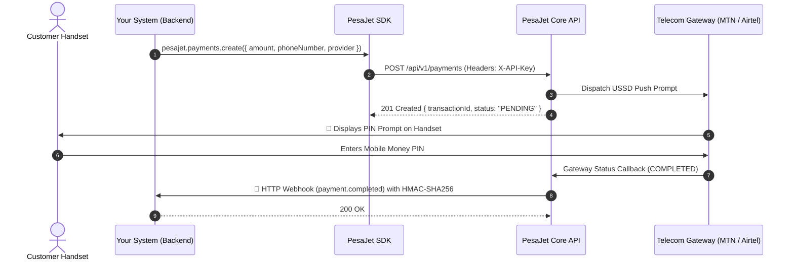

# 💳 PesaJet Payments Integration Reference & SDK

> The official reference implementation, plug-and-play TypeScript/Node.js SDK, and interactive developer demo for integrating Ugandan Mobile Money payments (**MTN MoMo** & **Airtel Money**) with **PesaJet Pay**.

---

## 📑 Table of Contents

1. [Overview & Architecture](#-overview--architecture)
2. [Step-by-Step Integration Guide](#-step-by-step-integration-guide)
   - [Step 1: Authentication (`X-API-Key`)](#step-1-authentication)
   - [Step 2: Initiate Mobile Money Collection](#step-2-initiate-mobile-money-collection)
   - [Step 3: Handle Customer USSD Prompt & Status Polling](#step-3-handle-customer-ussd-prompt--status-polling)
   - [Step 4: Receive Webhook Event](#step-4-receive-webhook-event)
   - [Step 5: Send Disbursements / Payouts](#step-5-send-disbursements--payouts)
3. [Multi-Language Code Snippets](#-multi-language-code-snippets)
   - [Node.js / TypeScript SDK](#nodejs--typescript-sdk)
   - [Python (requests)](#python)
   - [PHP (cURL)](#php)
   - [cURL CLI](#curl)
4. [Phone Numbers & Carrier Rules](#-phone-numbers--carrier-rules)
5. [Idempotency & Safe Retries](#-idempotency--safe-retries)
6. [Interactive Web Demo & CLI Tools](#-interactive-web-demo--cli-tools)

---

## 🏗 Overview & Architecture

PesaJet provides unified mobile money infrastructure for East Africa. With a single API integration, you can accept payments and dispatch payouts across all major mobile telecom networks.



---

## 🚀 Step-by-Step Integration Guide

### Step 1: Authentication

All REST API requests require your merchant **Public API Key** passed in the `X-API-Key` HTTP header:

```http
POST /api/v1/payments HTTP/1.1
Host: payments.pesajet.com
X-API-Key: pk_live_your_merchant_key_here
Content-Type: application/json
```

---

### Step 2: Initiate Mobile Money Collection

To prompt a customer's phone for payment, send a `POST` request to `/api/v1/payments`:

```json
{
  "type": "COLLECTION",
  "amount": 25000,
  "currency": "UGX",
  "phoneNumber": "+256771234567",
  "provider": "mtn",
  "reference": "ORDER-9921",
  "description": "Annual Subscription - Pro Plan",
  "metadata": {
    "customerId": "cust_8812"
  }
}
```

#### Response (`201 Created`):

```json
{
  "transactionId": "550e8400-e29b-41d4-a716-446655440000",
  "status": "PENDING",
  "amount": 25000,
  "currency": "UGX",
  "phoneNumber": "+256771234567",
  "provider": "mtn",
  "reference": "ORDER-9921",
  "createdAt": "2026-08-28T21:30:00.000Z",
  "expiresAt": "2026-08-28T21:40:00.000Z"
}
```

---

### Step 3: Handle Customer USSD Prompt & Status Polling

After initiation, the customer's phone receives an instant USSD popup asking for their PIN.

You can query the status at any time via:

```http
GET /api/v1/payments/550e8400-e29b-41d4-a716-446655440000
X-API-Key: pk_live_your_merchant_key_here
```

Possible statuses:

- `PENDING`: USSD prompt sent, awaiting customer PIN.
- `PROCESSING`: Customer entered PIN, provider clearing payment.
- `COMPLETED`: Funds successfully deducted and credited to your merchant balance.
- `FAILED`: Customer cancelled, entered wrong PIN, or had insufficient funds.
- `EXPIRED`: Prompt timed out after 10 minutes without PIN entry.

---

### Step 4: Receive Webhook Event

When the payment clears, PesaJet dispatches a cryptographically signed webhook to your server endpoint:

```json
{
  "event": "payment.completed",
  "transactionId": "550e8400-e29b-41d4-a716-446655440000",
  "status": "COMPLETED",
  "amount": 25000,
  "currency": "UGX",
  "provider": "mtn",
  "reference": "ORDER-9921",
  "timestamp": "2026-08-28T21:30:15.000Z"
}
```

> 🔒 Always verify the `X-Webhook-Signature` header using HMAC-SHA256 and your Webhook Secret before fulfilling orders. See the `webhook/` demo folder for the reference verification server.

---

### Step 5: Send Disbursements / Payouts

To transfer funds from your merchant balance to a vendor or contractor's phone:

```json
{
  "type": "DISBURSEMENT",
  "amount": 50000,
  "currency": "UGX",
  "phoneNumber": "+256701234567",
  "provider": "airtel",
  "reference": "PAYOUT-5521",
  "description": "Vendor payout for invoices"
}
```

---

## 💻 Multi-Language Code Snippets

### Node.js / TypeScript SDK

Install or copy `src/pesajet.ts` into your project:

```typescript
import { PesaJet } from "./pesajet.ts";

const pesajet = new PesaJet({
  apiKey: process.env.PESAJET_API_KEY,
  baseUrl: "http://localhost:3000/api/v1", // or production URL
});

// 1. Initiate Payment
const payment = await pesajet.payments.create({
  amount: 25000,
  phoneNumber: "+256771234567",
  provider: "mtn",
  reference: "ORD-9912",
  description: "Web store purchase",
});

// 2. Poll until completed (optional helper)
const result = await pesajet.payments.pollUntilComplete(payment.transactionId, {
  maxAttempts: 20,
  intervalMs: 2000,
});
console.log("Final status:", result.status);
```

---

### Python

```python
import os
import requests

API_KEY = os.getenv("PESAJET_API_KEY")
BASE_URL = "http://localhost:3000/api/v1"

headers = {
    "Content-Type": "application/json",
    "X-API-Key": API_KEY,
}

payload = {
    "type": "COLLECTION",
    "amount": 25000,
    "currency": "UGX",
    "phoneNumber": "+256771234567",
    "provider": "mtn",
    "reference": "ORD-PY-001",
    "description": "Python Integration Checkout",
}

response = requests.post(f"{BASE_URL}/payments", json=payload, headers=headers)
data = response.json()
print("Transaction ID:", data["transactionId"])
```

---

### PHP

```php
<?php
$apiKey = getenv('PESAJET_API_KEY');
$baseUrl = 'http://localhost:3000/api/v1';

$payload = [
    'type' => 'COLLECTION',
    'amount' => 25000,
    'currency' => 'UGX',
    'phoneNumber' => '+256771234567',
    'provider' => 'mtn',
    'reference' => 'PHP-ORD-' . time(),
];

$ch = curl_init("$baseUrl/payments");
curl_setopt_array($ch, [
    CURLOPT_RETURNTRANSFER => true,
    CURLOPT_POST => true,
    CURLOPT_POSTFIELDS => json_encode($payload),
    CURLOPT_HTTPHEADER => [
        'Content-Type: application/json',
        'X-API-Key: ' . $apiKey,
    ],
]);

$response = curl_exec($ch);
$data = json_decode($response, true);
curl_close($ch);

echo "Transaction ID: " . $data['transactionId'];
?>
```

---

### cURL

```bash
curl -X POST "http://localhost:3000/api/v1/payments" \
  -H "Content-Type: application/json" \
  -H "X-API-Key: pk_live_your_key_here" \
  -d '{
    "type": "COLLECTION",
    "amount": 25000,
    "currency": "UGX",
    "phoneNumber": "+256771234567",
    "provider": "mtn",
    "reference": "ORD-CURL-01"
  }'
```

---

## 📱 Phone Numbers & Carrier Rules

PesaJet automatically routes transactions to the correct carrier based on Ugandan phone prefixes:

| Provider             | Prefixes                   | Example Format  |
| :------------------- | :------------------------- | :-------------- |
| **MTN Mobile Money** | `077`, `078`, `076`, `039` | `+256771234567` |
| **Airtel Money**     | `070`, `075`, `074`        | `+256701234567` |

> 💡 **Best Practice**: Always format phone numbers in international E.164 format (`+256...`).

---

## 🔒 Idempotency & Safe Retries

To prevent double-charging a customer due to network timeouts or retries, supply an `idempotencyKey`:

```json
{
  "amount": 10000,
  "phoneNumber": "+256771234567",
  "idempotencyKey": "order_88291_attempt_1"
}
```

If a request with the same `idempotencyKey` is resent within 24 hours, PesaJet returns the existing transaction rather than initiating a second charge.

---

## 🎮 Interactive Web Demo & CLI Tools

### 1. Start the Interactive Developer Portal

```bash
# Install dependencies
pnpm install

# Start interactive web app on port 8001
pnpm dev
```

Open **http://localhost:8001** to:

- Test interactive storefront checkout with live status meters.
- Generate and run code in Node.js, Python, PHP, and cURL in real-time.
- Calculate carrier & platform fee breakdowns.
- Monitor live transactions feed.

### 2. Run CLI Shortcuts

```bash
# Test MTN collection prompt
pnpm collect:mtn 15000 +256771234567

# Test Airtel collection prompt
pnpm collect:airtel 20000 +256701234567

# Send disbursement / payout
pnpm disburse 50000 +256771234567

# Calculate fee preview
pnpm preview 100000 mtn COLLECTION

# Query transaction status
pnpm status txn_550e8400...

# Run automated SDK tests
pnpm test
```
